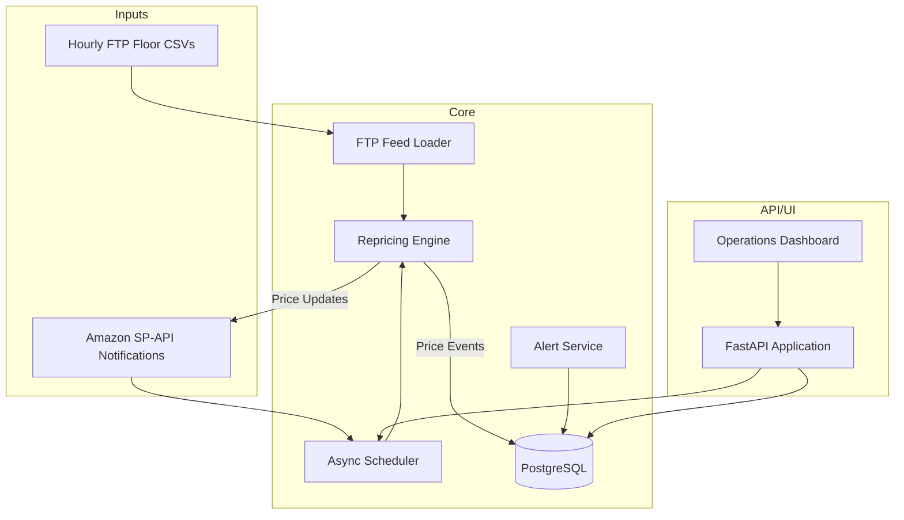

# Architecture Diagram

## Component Notes

- **Scheduler** – Consumes SP-API notifications, user-triggered actions, and timed fallbacks. It
  batches SKU work while respecting configurable concurrency limits.
- **Repricing Engine** – Applies pricing strategy rules, enforces floor prices, and logs each change
  to `price_events` for auditability.
- **FTP Loader** – Validates hourly floor files per marketplace and surfaces alerts when feeds are
  missing or stale beyond the configured threshold.
- **Alert Service** – Normalizes health issues (FTP, API failures, Buy Box drops) and stores them for
  dashboard visibility and future notification delivery (email/Slack).
- **FastAPI Application** – Hosts REST endpoints and the internal dashboard, exposing metrics,
  settings, manual controls, and alert feeds.
- **PostgreSQL** – Normalized schema capturing marketplaces, SKUs, repricing telemetry, and alerts.

## Database Schema Overview

| Table | Purpose |
| --- | --- |
| `marketplaces` | Amazon marketplace definitions and native IDs. |
| `skus` | SKU catalog with floor prices, Buy Box flag, and last update metadata. |
| `repricing_runs` | Batch run telemetry for monitoring throughput and failures. |
| `price_events` | Audit log of every price update including business pricing changes. |
| `alerts` | System alerts with severity, metadata, and acknowledgement flag. |
| `system_settings` | Configurable options editable from the dashboard. |

## Data Flow Summary

1. Hourly FTP feeds refresh floor price data per marketplace. The loader ingests CSVs and validates
   freshness before each repricing run.
2. SP-API notifications enqueue repricing events which the scheduler dispatches with fallback cycles.
3. The repricing engine fetches competitive pricing via SP-API, computes new prices within guardrails,
   pushes updates back to Amazon, and records results in the database.
4. The dashboard polls REST endpoints for metrics, health status, alerts, and configuration values,
   enabling operators to monitor and intervene in real time.
