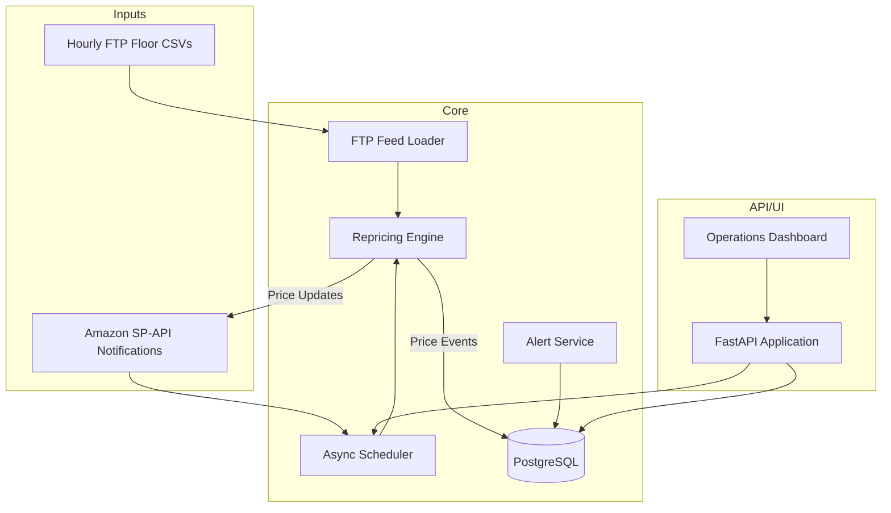

# Architecture Diagram

## Component Notes

- **Scheduler** – Consumes SP-API notifications, user-triggered actions, and timed fallbacks. It
  batches SKU work while respecting configurable concurrency limits.
- **Repricing Engine** – Applies pricing strategy rules, enforces floor prices, and logs each change
  to `price_events` for auditability. Dynamic guardrails (`max_price_change_percent`, Buy Box step-up
  percentage/interval) are injected here so pricing behavior can be tuned without redeploying.
- **FTP Loader** – Validates hourly floor files per marketplace and surfaces alerts when feeds are
  missing or stale beyond the configured threshold.
- **Alert Service** – Normalizes health issues (FTP, API failures, Buy Box drops) and stores them for
  dashboard visibility and future notification delivery (email/Slack).
- **FastAPI Application** – Hosts REST endpoints and the internal dashboard, exposing metrics,
  settings, manual controls, and alert feeds. The dashboard also exposes forms for sandbox test mode,
  repricing profile swaps, and bulk feed rehearsal.
- **PostgreSQL** – Normalized schema capturing marketplaces, SKUs, repricing telemetry, and alerts.
  The `system_settings` table stores both live guardrails and reusable repricing profiles.

## Database Schema Overview

| Table | Purpose |
| --- | --- |
| `marketplaces` | Amazon marketplace definitions and native IDs. |
| `skus` | SKU catalog with floor prices, Buy Box flag, and last update metadata. |
| `repricing_runs` | Batch run telemetry for monitoring throughput and failures. |
| `price_events` | Audit log of every price update including business pricing changes. |
| `alerts` | System alerts with severity, metadata, and acknowledgement flag. |
| `system_settings` | Configurable options editable from the dashboard. |

## Data Flow Summary

1. Hourly FTP feeds refresh floor price data per marketplace. The loader ingests CSVs and validates
   freshness before each repricing run.
2. SP-API notifications enqueue repricing events which the scheduler dispatches with fallback cycles.
3. The repricing engine fetches competitive pricing via SP-API, computes new prices within guardrails,
   pushes updates back to Amazon, and records results in the database.
4. The dashboard polls REST endpoints for metrics, health status, alerts, and configuration values,
   enabling operators to monitor and intervene in real time.

## Test Mode & Simulation Support

- **Sandbox connectivity** – Switching `Settings.sp_api_endpoint` to the Amazon sandbox keeps price
  updates and feed uploads isolated from production while exercising the same orchestration path.
- **Sample data ingestion** – Operators drop CSVs into `ftp_feeds/<marketplace>_floor_prices.csv` or
  submit them through the dashboard bulk upload form to seed simulations.
- **Scheduler telemetry** – `RepricingScheduler.stats` captures processed/updated/error counts per
  marketplace, surfaced via the dashboard "System Health" pane during a test run.
- **Historical review** – `repricing_runs` and `price_events` accumulate the outcomes of each
  simulation, including competitor context stored on the price-event `context` JSON column.

## Repricing Profiles & Dynamic Guardrails

- **Profile storage** – Named profiles live alongside other settings in `system_settings` as JSON
  payloads (`profile:<name>`). The active profile is mirrored into `max_price_change_percent`,
  `step_up_percentage`, and `step_up_interval_hours` rows consumed by the API.
- **Runtime application** – The dashboard's settings form (backed by `/api/settings`) posts guardrail
  changes that are immediately injected into `PricingStrategy` instances through dependency
  resolution.
- **Behavioral impact** – Profiles adjust how the repricer steps prices up while holding the Buy Box,
  how aggressively it chases competitors, and how much daily variance is allowed, enabling quick
  shifts between conservative and aggressive strategies without code changes.
